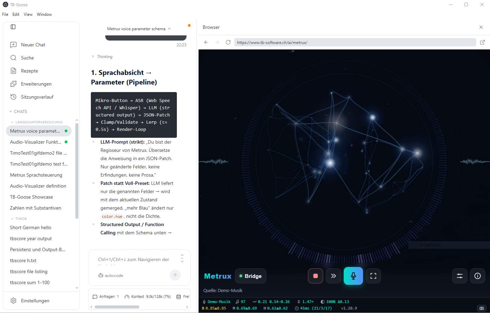
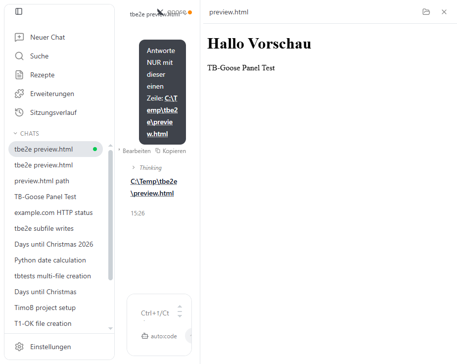
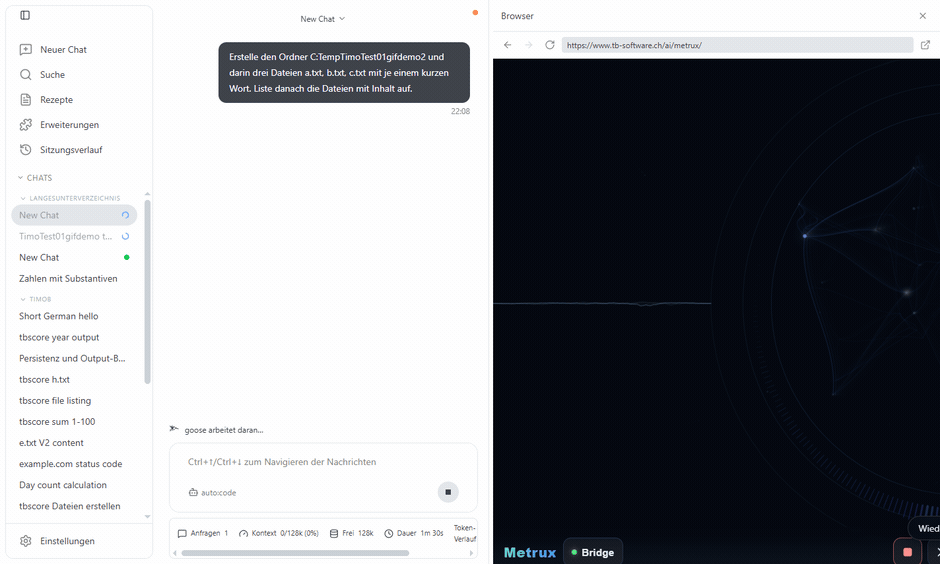
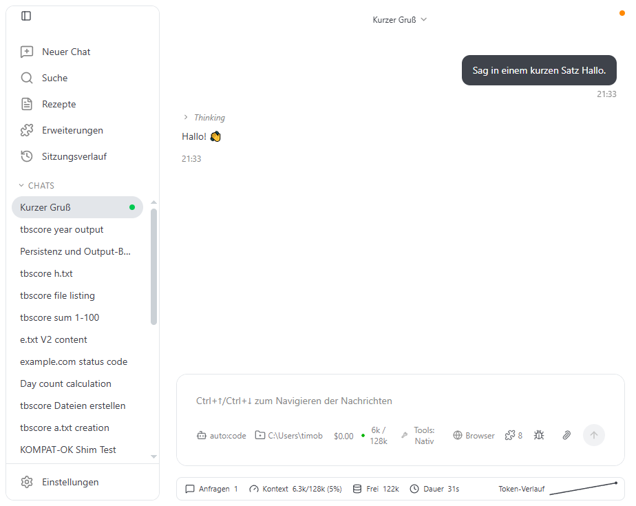

# TB-Goose

**Laientauglicher Desktop-Client für die TB-Software KI-Cloud (LLMProxy2)** — in normaler
Sprache Aufgaben stellen, lokale Dateien lesen/schreiben/ausführen und recherchieren, ohne
Terminal oder Editor-Wissen.

&nbsp;·&nbsp; Fork von <a href="https://github.com/aaif-goose/goose">Goose</a> (Block / Agentic AI Foundation)
&nbsp;·&nbsp; Windows-Desktop &nbsp;·&nbsp; native <code>tool_calls</code>

Links: eine KI-Session zum Feature-Design eines Audio-Visualizers · rechts: das
Ergebnis (<a href="https://www.tb-software.ch/ai/metrux/">Metrux</a>) live im eingebetteten Browser.

---

## Warum TB-Goose?

Für Entwickler gibt es Editor-/CLI-Agenten. Für **Nicht-Entwickler** fehlte ein einfaches
Fenster, in dem ein KI-Agent **wirklich** auf der Festplatte arbeitet — Dateien verwalten,
Code/Texte generieren, rechnen, recherchieren — bedient wie eine normale App. TB-Goose ist
genau das: eine native Desktop-GUI auf Basis von Goose, angebunden an die interne
LLMProxy2-Modell-Flotte.

## Was es besonders macht

- **🧠 Native `tool_calls`, verlässlich.** Über die Route `auto:code` führt der Agent Werkzeuge
  echt aus — kein Halluzinieren. In einer objektiven 8-Aufgaben-Batterie, **jedes Ergebnis
  unabhängig auf der Platte geprüft: 8/8** (inkl. echter Python-Rechnung, echtem Web-Abruf und
  einem selbst geschriebenen **und ausgeführten** Skript).
- **👁 Vorschau-Panel (rechts).** Markdown, Text, Code (Syntax-Highlight), HTML (Sandbox-iframe),
  Bilder und Video — mit **Auto-Refresh**, sobald sich die Datei auf der Platte ändert.

  

- **🌐 Eingebetteter, steuerbarer Browser.** Ein echter Browser (Electron-Webview) im rechten
  Panel — URL-Leiste, Zurück/Vor/Neuladen, fensterproportional breit. (Hier live: das
  TB-Software-Projekt **[Metrux](https://www.tb-software.ch/ai/metrux/)** direkt im Panel.)

  

- **📊 Metrik-Leiste.** Unten laufend die Kennzahlen des Chats: Anfragen, belegter/verbleibender
  Kontext, Kosten, Sitzungsdauer und ein Token-Verlauf-Sparkline.

  

- **📁 Sicheres Arbeitsverzeichnis.** Pro Chat wählbar; ein neuer Chat schlägt das zuletzt
  genutzte Verzeichnis vor. Existiert ein getippter Ordner nicht, fragt ein Dialog
  „Verzeichnis erstellen?". Der Agent ist angehalten, innerhalb dieses Ordners zu arbeiten.
- **🔎 Projekt-Suche.** Dateinamen in einem Projekt oder über alle Projekte finden; Datei-Pfade
  im Chat sind klickbar (öffnen im Explorer bzw. in der Vorschau).
- **🧩 Werkzeug-Modus umschaltbar.** „Nativ" (native `tool_calls`) oder „Kompatibel" (Text-Shim
  für Modelle ohne native Werkzeuge) — ein Klick in der Bottom-Bar.
- **🔁 Durchhalte-Schicht.** Persistenz-Instruktionen + **automatische Fortsetzung**, wenn eine
  Antwort am Ausgabe-Token-Limit abgeschnitten wird — lange autonome Läufe reißen nicht ab.

## Weitere Merkmale

- **🌍 EU-Telemetrie (opt-in).** Nutzungs-Events gehen an ein eigenes EU-PostHog (DSGVO-nah),
  nicht an Dritte.
- **🧪 E2E-Fernsteuerbar.** Elektron-CDP erlaubt automatisierte Tests + GUI-Validierung.
- **💾 Chat teilen/exportieren.** Ein Chat lässt sich als Datei exportieren und weitergeben.
- **🌗 Hell/Dunkel/System-Theme.**

## Grundlage & Lizenz

TB-Goose ist ein Fork von **[Goose](https://github.com/aaif-goose/goose)** (Block →
Agentic AI Foundation / Linux Foundation), **Apache-2.0**. Der KI-Agenten-Kern (Rust),
das ACP-Protokoll, Provider, Extensions und die Chat-UI stammen von Goose; TB-Goose ergänzt
eine anwenderorientierte Schicht (Vorschau, Browser, Suche, Metriken, Verzeichnis-UX),
Konfigurations-/Robustheits-Anpassungen und das Branding.

Die ursprüngliche Goose-README liegt unter **[README.upstream.md](README.upstream.md)**.

TB-Software · intern für LLMProxy2 · Screenshots zeigen das TB-Software-Projekt
<a href="https://www.tb-software.ch/ai/metrux/">Metrux</a>.
